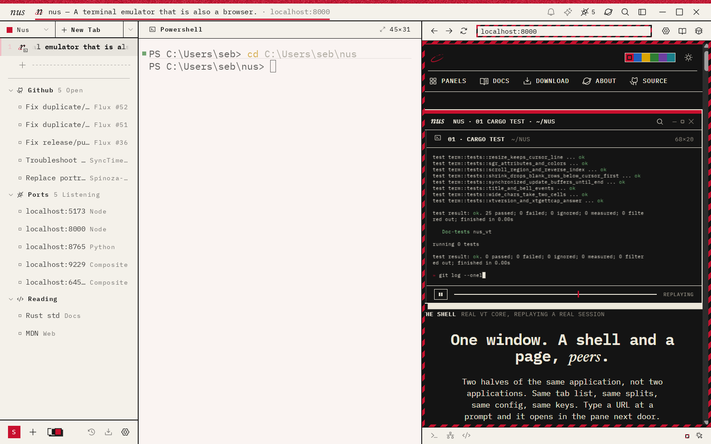
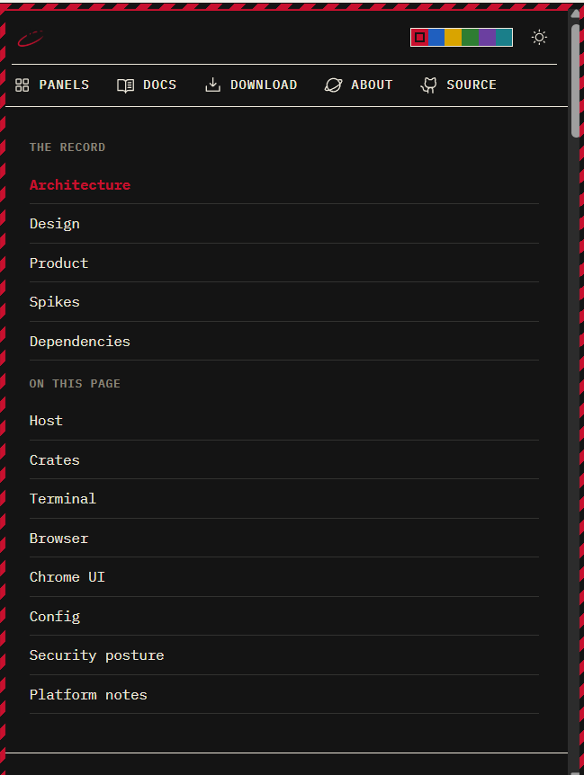
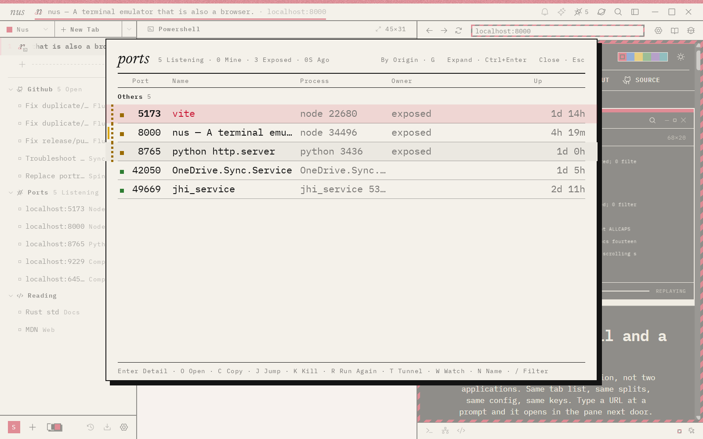
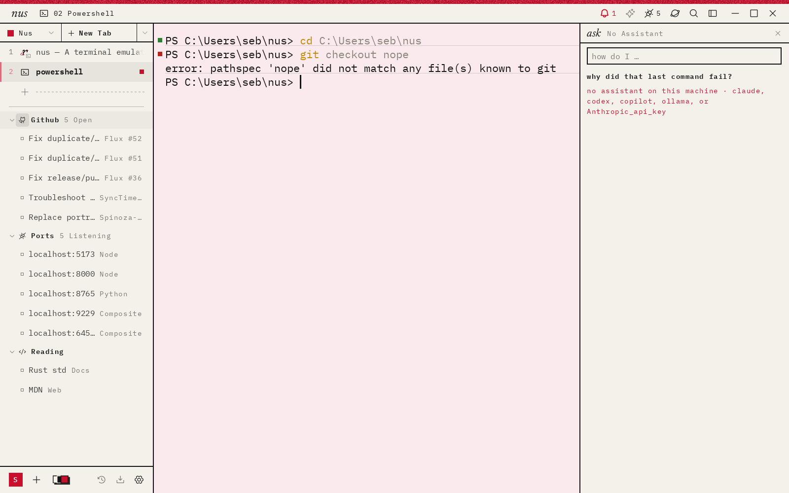
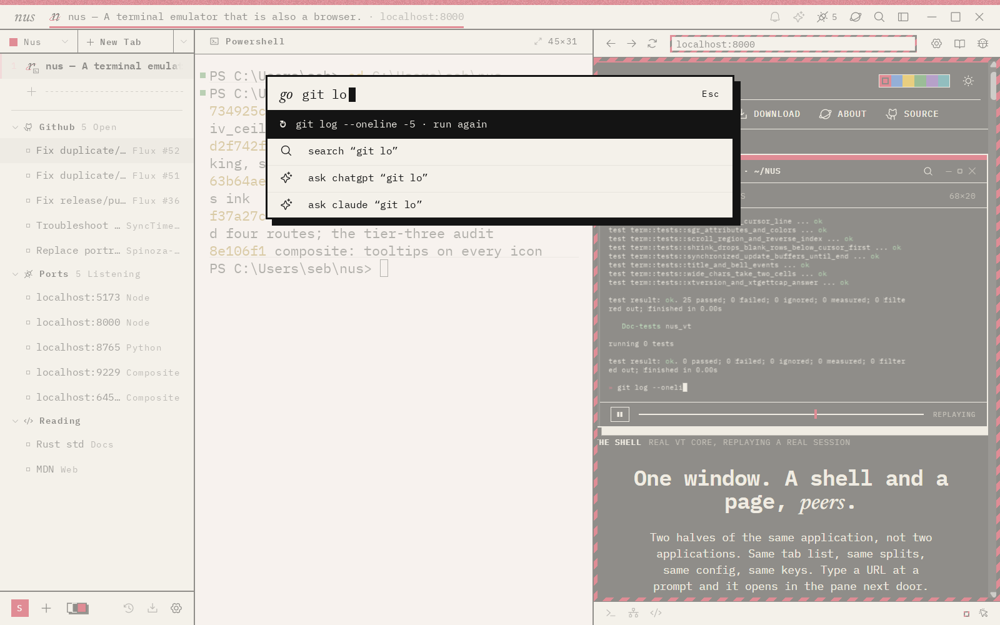
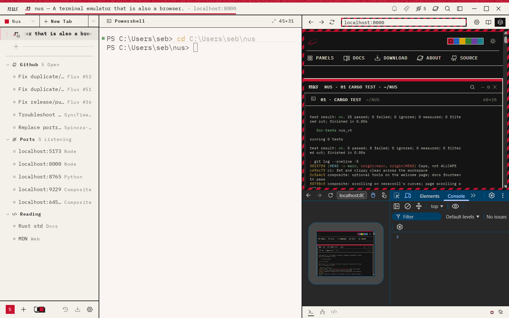

<h1 align="center">nus</h1>

<p align="center"><em>terminus</em>: the endpoint. the last terminal emulator, multiplexer, and browser you’ll install.</p>

<p align="center">
  <a href="https://github.com/cbassuarez/nus/releases">Download</a> ·
  <a href="docs/PRODUCT.md">Product</a> ·
  <a href="docs/ARCHITECTURE.md">Architecture</a> ·
  <a href="SECURITY.md">Security</a> ·
  <a href="CONTRIBUTING.md">Contributing</a>
</p>

<picture>
  <source media="(prefers-color-scheme: dark)" srcset="./docs/media/window-ink.png">
  <source media="(prefers-color-scheme: light)" srcset="./docs/media/window-paper.png">
  
</picture>

<p align="center"><sub>A shell and the page it started, in one workspace.</sub></p>

## Status

Native preview releases are published for macOS, Windows and Linux. They are previews: expect breakage and no support schedule.

| Platform | Target | Preview |
| --- | --- | :---: |
| macOS | Apple silicon | ✓ |
| Windows 11 | x86-64 | ✓ |
| Linux | Wayland + X11, x86-64 | ✓ |

[Download the latest preview](https://github.com/cbassuarez/nus/releases).

---

## What nus is

A terminal, browser, editor, local processes and an optional assistant usually live in separate applications even when they belong to the same task. nus gives them one window model: Spaces → tabs → splits. A shell and a page are peers; a URL typed at a prompt can open beside it, and the ports board can map a listener back to the shell that owns it.

<table>
  <tr>
    <td width="33%" align="center"><strong>shell + page</strong></td>
    <td width="33%" align="center"><strong>page as peer</strong></td>
    <td width="33%" align="center"><strong>process ownership</strong></td>
  </tr>
  <tr>
    <td>
      <picture>
        <source media="(prefers-color-scheme: dark)" srcset="./docs/media/window-ink.png">
        <source media="(prefers-color-scheme: light)" srcset="./docs/media/window-paper.png">
        
      </picture>
    </td>
    <td>
      <picture>
        <source media="(prefers-color-scheme: dark)" srcset="./docs/media/hero-page-ink.png">
        <source media="(prefers-color-scheme: light)" srcset="./docs/media/hero-page-paper.png">
        
      </picture>
    </td>
    <td>
      <picture>
        <source media="(prefers-color-scheme: dark)" srcset="./docs/media/ports-ink.png">
        <source media="(prefers-color-scheme: light)" srcset="./docs/media/ports-paper.png">
        
      </picture>
    </td>
  </tr>
</table>

---

## What it does

- **Terminal:** its own VT core (`crates/vt`), GPU-rendered, Kitty keyboard
  protocol, Kitty/iTerm2/Sixel images, OSC 133 blocks with lamps, folds and a
  share page, OSC 9;4 progress in the sidebar and taskbar, mouse reporting,
  DECRQSS/XTGETTCAP/XTVERSION.
- **Browser:** Chromium (CEF) rendered offscreen and composited by us. Native DevTools,
  a reader, per-site rules, ad blocking in the request handler,
  userscripts, containers, our own picture-in-picture. **No Chrome
  extensions today** — windowless CEF cannot host them; [docs/EXTENSIONS.md](docs/EXTENSIONS.md)
  explains the wall and the routes through it.
- **Incognito:** ⇧⌘N on macOS or Ctrl+Shift+N on Windows/Linux opens a private
  browser window with temporary cookies and storage, no saved browsing history
  or session restore, and downloads kept on disk. See [privacy and diagnostics](docs/PRIVACY_AND_DIAGNOSTICS.md).
- **One window model:** Spaces → tabs → splits. A shell and a page are peers;
  a URL typed at a prompt opens beside it. Stacks, folders (GitHub, ports,
  files), tiles, peeks, a compact mode, a quick terminal (the hatch).
- **An editor pane** on ropey with tree-sitter colour and a language-server
  client (`crates/lsp`); the prompt line gets a language server too.
- **The ports board:** what's listening, who owns it (down to the shell that
  started it), and what to do about it.
- **An assistant** that sees the shell, the block in focus and the page beside
  it; skills from rules; a memory file.
- **Remote control:** `nus ls · open · edit · launch · send-text · theme ·
  hatch · block · ask …` from any shell or script (`crates/cli`); rules can
  drive the window too.
- **Layouts as Luau files**, shell integration that rides over ssh, a
  Broadsheet look with a look studio and twenty stock themes.
- **Config:** sandboxed Luau (`rules.luau`) for rules, folders, chains, skills,
  ports, blocks, grouping, layouts.
- **A local profile, not an account:** a name, a face, the day it began,
  in a file in a folder on your machine. No server, no telemetry, nothing
  sent; the card that sets it up says so.
- **Sync without an account:** the profile on more than one device, sealed
  with a key you copy, carried by a folder you already sync or a private git
  remote; last writer wins ([docs/SYNC.md](docs/SYNC.md)).
- **Targets:** Windows 11 (daily), macOS (Apple silicon) and Linux (Wayland +
  X11).

---

## A few surfaces

<table>
  <tr>
    <td width="50%" align="center"><strong>Ports</strong></td>
    <td width="50%" align="center"><strong>Ask</strong></td>
  </tr>
  <tr>
    <td>
      <picture>
        <source media="(prefers-color-scheme: dark)" srcset="./docs/media/ports-ink.png">
        <source media="(prefers-color-scheme: light)" srcset="./docs/media/ports-paper.png">
        
      </picture>
    </td>
    <td>
      <picture>
        <source media="(prefers-color-scheme: dark)" srcset="./docs/media/ask-ink.png">
        <source media="(prefers-color-scheme: light)" srcset="./docs/media/ask-paper.png">
        
      </picture>
    </td>
  </tr>
  <tr>
    <td><strong>Palette</strong></td>
    <td><strong>DevTools</strong></td>
  </tr>
  <tr>
    <td>
      <picture>
        <source media="(prefers-color-scheme: dark)" srcset="./docs/media/palette-ink.png">
        <source media="(prefers-color-scheme: light)" srcset="./docs/media/palette-paper.png">
        
      </picture>
    </td>
    <td>
      <picture>
        <source media="(prefers-color-scheme: dark)" srcset="./docs/media/devtools-ink.png">
        <source media="(prefers-color-scheme: light)" srcset="./docs/media/devtools-paper.png">
        
      </picture>
    </td>
  </tr>
</table>

---

## What this is, and isn't

nus is my terminal and my browser. I built it for one user (me!) the way I
want it, and I use it every day. I made it for personal and professional work, because none of the popular cross-platform tools integrated with the popular cross-platform browsers. I leave it FOSS as someone else might get some use out of this.

That means:

- **I decide the design.** The product decisions live in [docs/PRODUCT.md](docs/PRODUCT.md)
  and [docs/DESIGN.md](docs/DESIGN.md); each "settled" pass there is a decision
  already made. A change that contradicts them is out of scope, however good.
- **Feature requests are welcome.** Describe the problem you want to solve;
  requests inform development without promising implementation. Check whether
  a setting, `rules.luau`, a theme or a layout already covers it.
- **I read bug reports and small fixes.** A crash with a reproduction, a
  platform build fix, a typo, a wrong doc: very much welcome. I’ll try to stamp out bugs as quickly as they come in. See
  [CONTRIBUTING.md](CONTRIBUTING.md) before opening anything, and email contact@cbassuarez.com for secured/responsible disclosure of vulnerabilities. There are limited funds available (I am one person, funding this by themselves, though I am awaiting extra funding to establish an actual program).
- **Preview releases, no support schedule.** Native previews are published for
  macOS, Windows and Linux. Expect breakage and expect no answer on a schedule.

---

## Building

Requires stable Rust (`rustup`), plus:

- Windows: VS 2022 with the *Desktop development with C++* workload.
- macOS: Xcode command line tools.
- Linux: `build-essential pkg-config libwayland-dev libxkbcommon-dev libgtk-3-dev`.

```
scripts/fetch-cef.sh              # the CEF binary matching vendor/cef-rs, into vendor/cef
export CEF_PATH=$PWD/vendor/cef   # see vendor/cef-rs/README.md for per-OS library paths
cargo build                       # the workspace crates
cd spikes/composite && cargo build   # the app (still called the composite spike)
```

`spikes/composite` is the app; it moves into `crates/app` when the spike is
done. See [docs/SPIKES.md](docs/SPIKES.md) for what was de-risked and
[docs/ARCHITECTURE.md](docs/ARCHITECTURE.md) for the decisions.

## Credits

Phosphor Icons (MIT), IBM Plex Mono (OFL), Newsreader (OFL), the Chromium
Embedded Framework (BSD), tree-sitter and its grammars (MIT), ropey (MIT),
Neovide's cursor renderer and neoscroll's easings (MIT, ported). See
[NOTICE](NOTICE).

## License

MIT. See [LICENSE](LICENSE).
