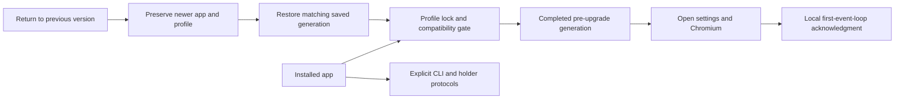

# Multi-version continuity

nus uses Current plus one previous feature line before introducing LTS. A feature
line is `major.minor`; patches do not move its support deadline. The previous
line receives security, data-loss and major regression fixes for 30 days from
the successor's promotion. Another feature promotion must wait out that overlap.
Archived downloads are not a promise of ongoing maintenance.

`release-support.json` is the reviewed promotion ledger. It deliberately starts
without invented stable release dates. Register the first stable line when it
actually ships. `scripts/release-support.py` rejects stable publication outside
the maintained lines, overlapping promotions, and future promotion dates.
Previous-line patches never become GitHub's `latest` release. Preview remains
opt-in through a separately installed Preview build and profile.
Publication reads the current ledger from `main`, rather than trusting a stale
copy in a maintenance branch. Backport the publication gate with maintenance fixes;
pre-gate workflow revisions cannot acquire these rules retroactively.

## Compatibility boundaries

`nus-compat` is independent of CEF and the GUI. Version numbers have distinct
jobs: application SemVer, profile contract schema, aggregate profile format,
per-store format versions, Chromium major, CLI protocol, and holder protocol.
Do not derive a wire protocol or disk schema from an app patch number.

The profile contract currently registers settings, reading list, saved commands,
sessions, vault, and process snapshot formats. Some stores previously had no
outer version envelope; their existing representation is format 1 under this
contract. Any incompatible store change must bump its registered format and add
explicit migration fixtures. Saved commands live in settings and use that schema.
Chromium major downgrades are rejected conservatively; equal major versions do
not imply every Chromium data change is safe, so application downgrades also
require a saved generation.

## Startup and migration safety

Before preferences can salvage data, before vault migration, and before CEF
initializes a cache, the app obtains an OS file lock outside `profile/`. A second
launch can hand off URLs, but cannot become a second writer. Lock ownership ends
when the process exits; there is no stale PID file to delete to take over.

Unknown contract versions, newer store formats, lower application versions,
lower Chromium versions, cross-channel use, and ahead-of-build legacy settings
schemas stop startup with an explanatory error. The original data stays intact.
Current, Preview and Development use separate installation channel directories.
Manual redownloads retain the existing separate Welcome/import behavior.

Before an application, Chromium-major or registered store-format change, nus copies the quiescent profile to
`generations/generation-*/profile`. `complete.json` is committed only after the
copy finishes. Copies preserve vault ciphertext and its public key identifier;
encryption keys remain in the OS credential store. The snapshot includes browser
databases and nus data, excluding runtime instance credentials, holder records,
vault locks and Chromium singleton links. It never traverses project symlinks.
Other links, special files, excessive nesting, copy failures, and profiles over
the 20 GiB per-generation budget abort the transition. There is no automatic
history deletion. These copies need ordinary local disk protection; browser
databases and legacy plaintext were not made fully encrypted by this feature.

Existing store migrations still run during startup after the generation commits.
This is a recoverable migration boundary, **not** a claim that every existing
store migration is an atomic multi-file transaction. Future destructive migrations
should transform a staged profile, validate it, then publish it through the same
two-rename recovery journal. Add skipped-version fixtures whenever formats change.

The first completed GUI tick records `healthy: true` locally. This acknowledges
opening the app, not comprehensive health, process resumption, or remote rollout
success. Nothing is uploaded. Failed startup is not silently auto-rolled-back:
that could restart programs twice or hide work created after an upgrade.

## Recovery

Updates retain the old application package and record its version/path. The next
startup associates it with the completed pre-upgrade profile generation. Settings
offers **Return to previous version…** only when this pair exists. A warning is
followed by graceful shutdown, the package swap, and the old binary restoring the
matching generation before opening its profile. The newer application remains in
the retained `.nus-recovery-*` directory beside the installation; the newer profile
remains under `preserved-generation-*` in the installation data root. Projects are
never reverted. No holder records are restored, and the recovery launch opens the
prompt rather than automatically restoring sessions or startup layouts.

Recovery copies first and records `recovery-pending.json` before renaming. If
interrupted between renames, ordinary startup stops; repeating the same recovery
finishes it without overwriting either generation. A generation can be recovered
once per preserved destination; repeated attempts do not overwrite newer work.

For a GUI that cannot start, launch the **matching retained version** in its
installed location with `--recover-profile=generation-ID`. Use the generation ID
from `last-generation.json`; a different selected ID cannot override an unfinished
recovery. The old application must be restored to its installation path before
using this switch. All app windows using that profile must be closed first.
If a package swap itself fails, the helper retains/restores the original package.
Windows running helpers can prevent the move; they are not force-killed.

**Bootstrap limit:** builds predating this contract cannot obey it retroactively.
Initial adoption does not copy an unversioned profile: it could duplicate sensitive
legacy plaintext before vault migration, and there is no compatible automatic
restore contract. Install such a binary separately and explicitly import only compatible data. Do not point an
old binary at a profile written by this release. An old updater that ignores new
withdrawal fields also cannot acquire that behavior retroactively.

## Components and managed agents

CLI requests include `protocol`; the receiver rejects mismatches before dispatch.
Missing protocol is explicitly the supported legacy v1, not an arbitrary fallback.
Holder metadata advertises its wire version. Negotiated attachments authenticate
and check the protocol before replacing an existing client; clients also verify
the returned holder identity. An incompatible holder is left running and its
record is preserved. The original unversioned holder remains an explicit legacy
path. A timeout or unknown ping response no longer deletes a live holder record.

The managed agent runtime should use the same model: protocol negotiation plus
an independently versioned snapshot envelope containing runtime, provider adapter,
agent version and required capabilities. Restoration must check all of them before
issuing a RUN block. This pass does not intercept independent CLI-owned sessions,
make their snapshots portable, or establish exactly-once agent resumption. See
[the managed runtime design](MANAGED_AGENT_RUNTIME.md).

## Release admission and withdrawal

Published release notes retain the existing embedded `nus-release` manifest. New
manifests include `state: active` and maintenance classification. Set `state` to
`withdrawn` to stop new updater offers; preserve asset hashes and historical notes.
An optional `minimum_updater` SemVer excludes older updaters that need a bridge
release. The companion site also excludes withdrawn releases and sorts by version,
so a newly published previous-line patch cannot downgrade its recommended download. The updater checks metadata again before download and after package
verification. If GitHub is unavailable during revalidation it does not install a
cached offer. The candidate must answer `--compatibility` and accept the current
contract before nus exits. Preview never silently becomes Current.

Withdrawal cannot retract bytes already installed or eliminate the last network
race after the final recheck. No-telemetry clients cannot prove a rollout succeeded.
The release operator must review voluntary reports and test outcomes. Keep emergency
patches on the maintained branch; do not wait for another feature promotion.

Before promoting a candidate, record clean install, predecessor upgrade, skipped
release upgrade, interrupted migration, profile recovery, locked helper and
CEF/security checks on macOS, Windows and Linux. The compatibility workflow tests
the portable contracts on all three runners; the packaging workflow tests/builds
the app. These jobs do not replace native signed-install/recovery exercises.

## Support and platform promises

Settings shows the exact allowlisted **Copy support details** text before copying:
app/build, Chromium, OS family, architecture, channel, and schema/protocol versions.
It includes a fixed failure code for a failed update check, installation or recovery
preparation in this session. It contains no profile ID, tokens, paths, commands or project contents. It does not
send a report. Accept reports from archived versions, triage their severity, and
state whether a maintained-line patch or an upgrade resolves them.

The initial package targets are macOS ARM64, Windows x86-64 and Linux x86-64.
Those are build targets, not a verified minimum-OS promise. Keep exact minimum OS,
Linux distro/runtime requirements, CEF version, signed-package evidence and security
end dates in each release's platform matrix. Do not infer supported minimums from
the CI runner versions. CEF security updates may be required within a maintained
line; a stable nus line must not freeze an unsafe browser engine.

## Verification

Run `cargo test -p nus-compat -p nus-cli -p nus-hold`, rebuild `nus-hold`, and run
`cargo test -p nus-pty --test hold` with an available native credential store.
The holder test also verifies that a future protocol cannot disconnect an attached
shell. Run composite tests separately with the repository CEF environment.
Run `python3 scripts/test-release.py` and
`python3 -m unittest discover -s scripts/tests -p test_release_support.py`.

The release-support ledger needs its first real promotion entry before stable
publication. LTS, percentage rollout, automatic rollback, cross-machine recovery,
and a signed independently verified Linux update manifest remain separate work.

### Implementation verification, 2026-09-23

- Composite: 283 tests passed, one ignored, with native credential-store and
  loopback access. The initial sandbox run could not exercise those fixtures.
- Root workspace: 113 tests passed after rebuilding the regular `nus-hold`
  companion; an earlier run used a companion that failed to start. The final
  compatibility crate has seven passing tests, including the subsequently added
  same-app-version store-format checkpoint regression.
- Publication: 13 tests passed; maintenance policy: three tests passed.
- Companion site: all 47 tests passed, including withdrawal and previous-line
  download ordering. The loopback streaming fixture required native permissions.
- Windows cross-compilation: compatibility, CLI and holder crates passed. Linux
  cross-compilation: compatibility and CLI crates passed. These are compile checks,
  not native installation or UI tests.
- `scripts/check-multiversion.py` passed against an isolated macOS bundle: healthy
  launch, newer profile format refusal, newer Chromium refusal, wrong-channel
  refusal, downgrade refusal, and profile recovery preserving newer work. It uses
  a disposable profile and synthetic version metadata; it does not download or
  swap real signed release packages. Existing package-helper tests exercise the
  filesystem swap and failed-swap restoration with synthetic packages.

Real signed old/new package pairs, skipped-release upgrade fixtures, and native
Windows/Linux install/recovery exercises remain mandatory release gates. No
release, GitHub setting, or deployed website was changed by this implementation.
